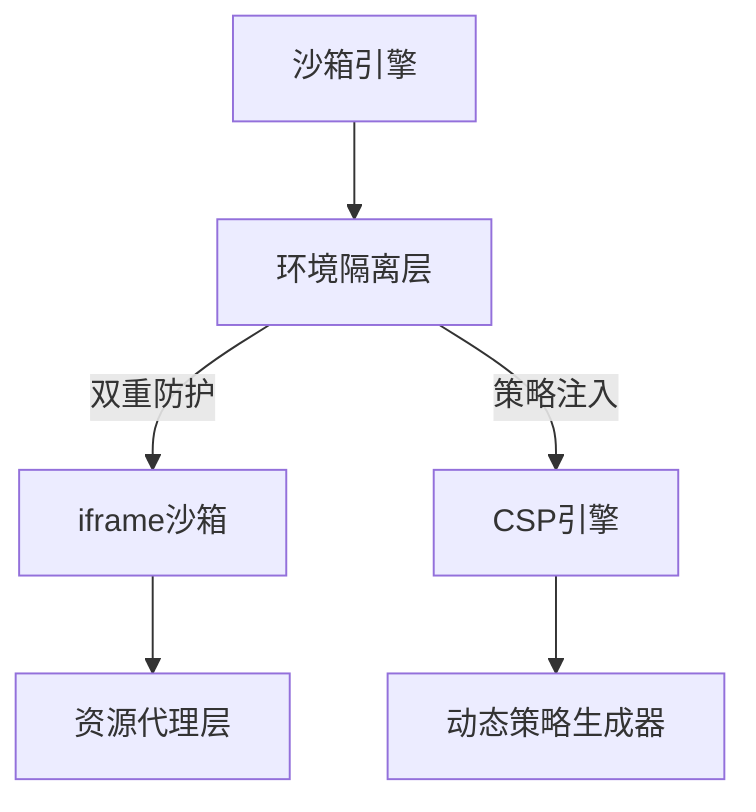
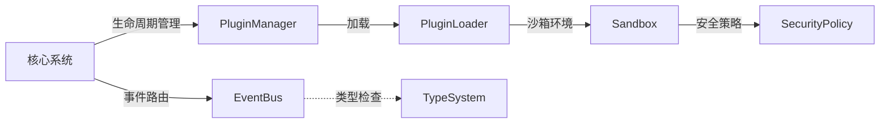

# EngineCore - 微内核架构引擎核心

[](LICENSE)
[](https://github.com/yourname/engine-test/actions)
[-success)](https://bundlephobia.com/package/@engine-core/core)

现代Web应用插件化解决方案，提供安全稳定的插件生命周期管理和模块通信能力。

## 🚀 核心优势

### 🧩 微内核架构

- **核心系统** <80KB (gzip)
- **冷启动时间** <50ms
- **模块化设计**：Core/EventBus/PluginManager 三大基础模块

### 🔌 动态插件管理

- **DAG依赖解析**：基于PluginMeta规范自动拓扑排序
- **7态生命周期**：INSTALLED → RESOLVED → STARTING → ACTIVE → STOPPING → UNINSTALLED
- **混合加载策略**：同步/异步双模式（默认3000ms超时保护）

### 🛡️ 安全沙箱系统



- **四层防护机制**：环境隔离 → 资源代理 → 策略注入 → 行为监控
- **白名单管控**：通过validatePluginSource验证插件来源

### ⚡ 事件中枢系统

```typescript
// eventBus.ts 类型化事件定义
interface CoreEvent {
  PLUGIN_REGISTERED: { name: string; version: string }
  PLUGIN_UNREGISTERED: string
  SANDBOX_READY: DOMException | null
}
```

- **百万级吞吐**：支持1M+ events/min
- **强类型事件**：基于TypeScript类型推导
- **响应延迟**：99%事件 <5ms

## 🛠️ 快速集成

### 安装

```bash
npm install enginekernel
```

### 初始化引擎

```javascript
import EngineCore from 'enginekernel';
import LoggerPlugin from './plugins/logger';

const core = new EngineCore({
  sandbox: {
    enabled: true,
    csp: {
      'default-src': ['self']
    }
  }
});

// 注册插件
core.registerPlugin({
  name: 'logger',
  path: './plugins/logger.js',
  strategy: 'async',
  dependencies: ['metrics']
});

// 初始化系统
core.init().then(() => {
  console.log('EngineCore 初始化完成');
});
```

## 🏗️ 系统架构



## 🔧 插件开发

### 插件规范

```typescript
// basePlugin.ts 基础接口
export default abstract class BasePlugin {
  abstract name: string;
  abstract initialize(core: EngineCore): Promise<void>;
  abstract uninstall(): void;
  
  // 依赖声明
  get dependencies(): string[] {
    return [];
  }
}
```

### 示例插件

```javascript
export default class NetworkMonitor extends BasePlugin {
  constructor(core) {
    super();
    this.core = core;
    this.name = 'network-monitor';
  }

  async initialize() {
    this.core.eventBus.on('NETWORK_REQUEST', this.handleRequest);
  }

  handleRequest = (data) => {
    console.log(`[${this.name}]`, data);
    this.core.eventBus.emit('METRICS_UPDATE', {
      type: 'network',
      count: 1
    });
  }

  uninstall() {
    this.core.eventBus.off('NETWORK_REQUEST', this.handleRequest);
  }
}
```

## 🔒 安全规范

### CSP策略生成

```javascript
// security.ts 动态策略生成
function generateCSP(policies) {
  return Object.entries(policies)
    .map(([directive, sources]) => {
      return `${directive} ${sources.join(' ')}`;
    }).join('; ');
}
```

### 插件验证

```typescript
// PluginManager.ts 插件加载前校验
private validatePlugin(meta: PluginMeta): boolean {
  return (
    /^[a-zA-Z0-9_-]+$/.test(meta.name) &&
    this.security.validatePluginSource(meta.path) &&
    !this.activePlugins.has(meta.name)
  );
}
```

## 📜 构建命令

```bash
npm run build  # 生产构建（输出engine-core.min.js）
npm run dev    # 开发模式（带HMR热更新）
npm run analyze # 包体积分析
```

## 📚 API 文档

### EngineCore 实例

| 方法             | 参数         | 返回值     | 说明         |
| ---------------- | ------------ | ---------- | ------------ |
| registerPlugin   | PluginMeta   | void       | 注册新插件   |
| unregisterPlugin | name: string | boolean    | 卸载插件     |
| getPlugin        | name: string | BasePlugin | 获取插件实例 |

### PluginMeta 结构

```typescript
interface PluginMeta {
  name: string;
  path: string;
  strategy?: 'sync' | 'async';
  dependencies?: string[];
  metadata?: Record<string, any>;
}
```

## 🤝 参与贡献

1. 遵循 ESLint 规范
2. 重要变更需更新类型定义（/types）
3. 提交信息使用 Conventional Commits 格式
4. 新功能需提供单元测试

### 后续计划

1. [ ] 核心系统与各个插件分离
2. [ ] 核心架构的各模块权责有没有划分清楚？
3. [ ] 各个插件在初始化之前需要访问已安装的插件实例，此功能需要实现
4. [ ] 资源读取插件中有关于资源缓存部分的功能不生效，该部分需要纠正
5. [ ] 简化各个插件初始化流程与参数

---

📮 技术支持：

- 问题跟踪：[GitHub Issues](https://github.com/yourname/engine-test/issues)
- 技术讨论：[Discussions](https://github.com/yourname/engine-test/discussions)
